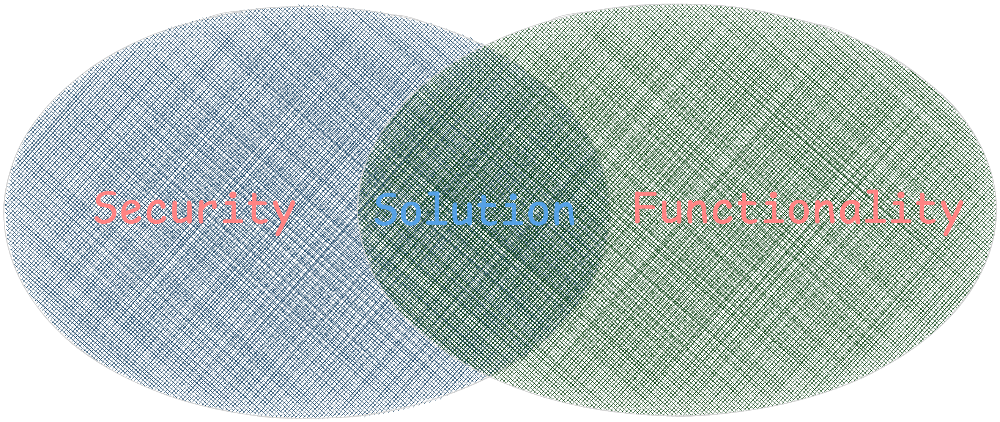
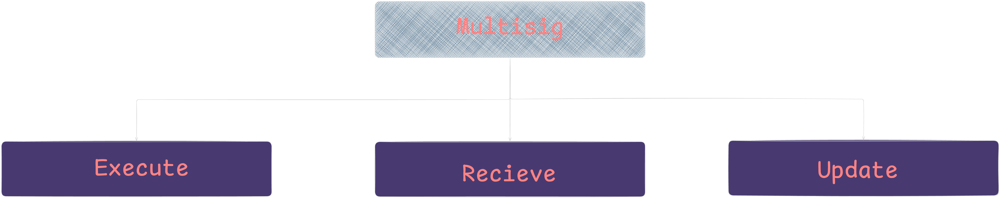

# Multisig Contract

## Problem statement
As discussed, we would like to give you a little homework. Please implement a smart contract for
a multisig wallet in your preferred smart contract VM (Solidity/EVM, Rust/Cosmwasm, Rust/Solana
etc.).

## Goal 
 1. How you approach a new challenge.
 2. Which issues you faced along the way.
 3. How you design a solution.
 4. How you think about its security.
  

## Requirements 
1. The multisig contract allows k-of-n signers to execute an arbitrary method on an arbitrary contract
2. Anyone can execute the multisig as long as they provide the required signatures
3. The blockchain’s native transaction/signature verification mechanism should NOT be used for it,
i.e. the verification should happen within the smart contract, and not via the chain’s native account
authorization/multisig feature.
4. Feel free to pick any signature scheme to use for the multisig
5. The multisig should also allow the current signers to sign off on an update to a new signer set
6. Define a list of tests that you would add for coverage (they don’t need to be implemented).


# Solution 
### Design Philosophy 
**KISS: Keep It Simple, Stupid** </br>
  *- Kelly Johnson* 

The two primary principles that will dictate the design for this would be functionality and security, Once the design meets at the intersection of both and works as intended, the solution is complete, everything beyond that becomes excess weight. 

The objective is to minimize code and by extension, minimize attack surfaces. 



## Approach
A systematic approach will be used to build the contract, it will be a bottom up approach, breaking down each logical building block and building while reasoning the security of the single block and then at the end, looking at the security of the system *as is*, before moving on to the next reponsibility. 

## Threat model 

The [Threat Model Manifesto](https://www.threatmodelingmanifesto.org/) will be used, to evaluate each logical block, with focus on the first three questions. And the fourth will be evaluated at the end of the system build.
1. What are we working on?
2. What can go wrong?
3. What are we going to do about it?
4. Did we do a good enough job?

Each logical block will be evaluated on both the attack sufface it introduces in isolation and in the system. 


## System design 
### External functions


### Logical blocks
- [x] Skeleton (State variables, functions, events & modifiers)
- [ ] Access Control
- [ ] Call 
- [ ] Signature Verification
- [ ] Funds Transfer
- [ ] Update signer

### Skeleton 
This is the basic. It will be included in all subsequent tests. 

```solidity
contract Multisig {

    struct ownerHistory {
        address[] owners;
        uint256 nonce; // nonce when owners removed. 
        uint256 threshold;
    }

    address[] public owners;
    mapping(address => bool) public isOwner;
    uint256 public threshold; 
    uint256 public nonce; 

    ownerHistory[] public history; // history of the multisig. computation should be done offchain 

    modifier onlyContract() {
        require(msg.sender == address(this), "Not authorized");
        _;
    }

    event Executed(address indexed to, uint256 value, bytes data, bool success, uint256 nonce);
    event Updated(address[] newOwners, uint256 newThreshold, uint256 nonce);
    event Received(address indexed sender, uint256 amount);

    constructor(address[] memory _owners, uint256 _threshold) {}

    function execute(address to, uint256 value, bytes calldata data, bytes[] calldata signatures) external returns (bool) {}

    function update( address[] memory _owners, uint256 _threshold) external returns (bool){}

    receive() external payable {}
}
```


